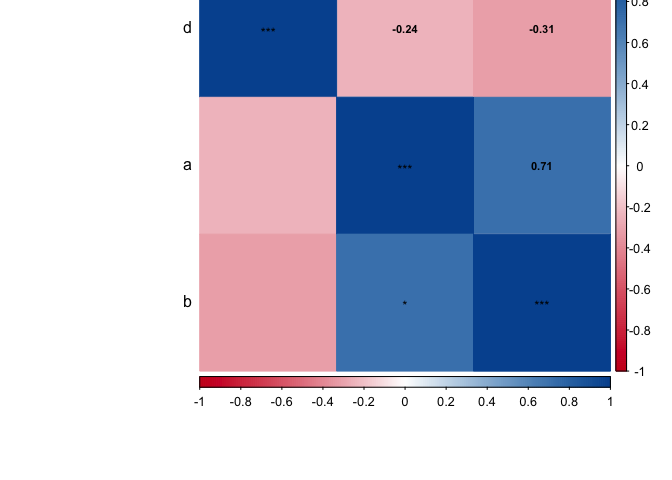

hcic tools
================
André Calero Valdez

-   [Package Contents](#package-contents)
-   [Including Code](#including-code)
-   [Plotting Features](#plotting-features)
-   [TBC](#tbc)

Package Contents
----------------

This is a package that contains helpful functions for survey data analysis. It is maintained by the Human-Computer Interaction Center at RWTH Aachen University.

Including Code
--------------

You can install this packages by running the following code.

``` r
  install.packages("devtools")
  library(devtools)
  devtools::install_github("HCIC/r-tools")
```

Plotting Features
-----------------

### Correlation Plots

``` r
a <- c(1,2,3,8,4,5,6,7)
b <- c(4,5,6,7,3,8,9,10)
d <- c(4,2,5,2,5,2,1,5)
df <- data.frame(a=a, b=b, d=d)

cor.matrix.plot(df)
```



### Confidence Interval Plots

It has a confidence interval plotting feature for indepedent sample tests.

``` r
plot_IS_meansCI(a, b)
```


TBC
---

More to follow
