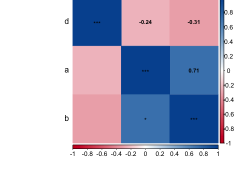
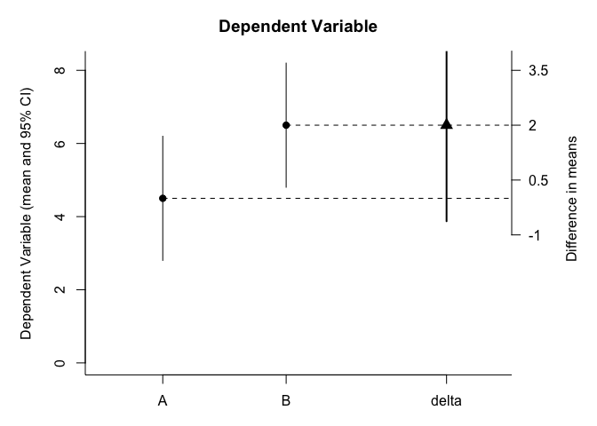
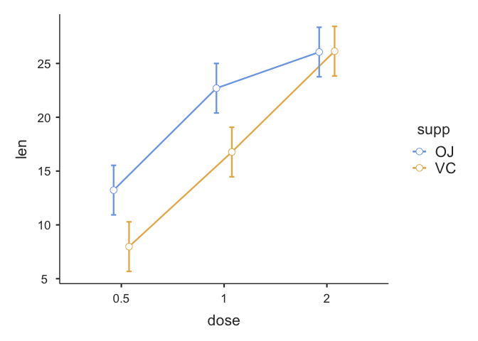
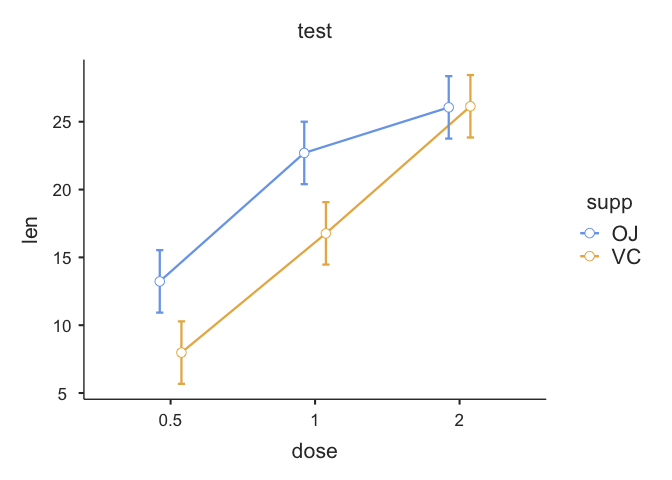

<!-- README.md is generated from README.Rmd. Please edit that file -->

# hcictools

<!-- badges: start -->

[](https://github.com/statisticsforsocialscience/hcictools/actions)
[](https://lifecycle.r-lib.org/articles/stages.html#experimental)
<!-- badges: end -->

The goal of hcictools is to make frequently recurring tasks in our work
easier.

## Installation

You can install the released version of hcictools from
[CRAN](https://CRAN.R-project.org) with:

``` r
# install.packages("remotes")
remotes::install_github("statisticsforsocialscience/hcictools")
```

## Package Contents

This is a package that contains helpful functions for survey data
analysis. It is maintained by the Human-Computer Interaction Center at
RWTH Aachen University.

## Plotting Features

### Correlation Plots

``` r
a <- c(1,2,3,8,4,5,6,7)
b <- c(4,5,6,7,3,8,9,10)
d <- c(4,2,5,2,5,2,1,5)
df <- data.frame(a = a, b = b, d = d)

cor.matrix.plot(df)
```



### Confidence Interval Plots

It has a confidence interval plotting feature for indepedent sample
tests.

``` r
plot_IS_meansCI(a, b)
```



## RWTH Palette

Drawing palettes and RWTH Corporate CI Colors

``` r
draw.palette(unlist( rwth.colorpalette() ))
```


## auto-code scale

Automatically extract item orientation and create mean score of items
that have a prefix.

``` r
newbfi <- psych::bfi %>% head(50) %>% auto_score("A")
#> 
#> Adding scores for the A scale.
#> 
#> ===============================================================
#> 
#> ---------------------------------------------------Testing keys
#> Reliability analysis   
#>  raw_alpha std.alpha G6(smc) average_r S/N   ase mean  sd median_r
#>       0.22      0.64    0.67      0.23 1.8 0.093   18 2.1     0.27
#> 
#> ------------------------------------------------Possible drops?
#>     raw_alpha std.alpha   G6(smc) average_r       S/N   alpha se      var.r
#> age 0.6401512 0.6735669 0.6765065 0.2921271 2.0634151 0.08165305 0.03274543
#> A4  0.2039064 0.6541140 0.6725009 0.2744292 1.8911263 0.08524789 0.03775861
#> A3  0.2014994 0.5838783 0.5972353 0.2191335 1.4031431 0.08112586 0.03278488
#> A2  0.1909211 0.5791379 0.6054611 0.2158186 1.3760754 0.09053765 0.04011820
#> A5  0.1579202 0.4883062 0.4966575 0.1602698 0.9542936 0.08427459 0.02453107
#> A1- 0.1088703 0.5979811 0.6158001 0.2292806 1.4874455 0.10018208 0.04319743
#>         med.r
#> age 0.3202747
#> A4  0.3022303
#> A3  0.2217505
#> A2  0.2368598
#> A5  0.1280172
#> A1- 0.1979787
#> 
#> ---------------------------------------------------Calculating scale
#> Call: psych::scoreItems(keys = keys, items = data_set, min = 1, max = 6)
#> 
#> (Unstandardized) Alpha:
#>          A
#> alpha 0.22
#> 
#> Standard errors of unstandardized Alpha:
#>          A
#> ASE   0.13
#> 
#> Average item correlation:
#>               A
#> average.r 0.044
#> 
#> Median item correlation:
#>    A 
#> 0.27 
#> 
#>  Guttman 6* reliability: 
#>             A
#> Lambda.6 0.32
#> 
#> Signal/Noise based upon av.r : 
#>                 A
#> Signal/Noise 0.27
#> 
#> Scale intercorrelations corrected for attenuation 
#>  raw correlations below the diagonal, alpha on the diagonal 
#>  corrected correlations above the diagonal:
#>      A
#> A 0.22
#> 
#>  In order to see the item by scale loadings and frequency counts of the data
#>  print with the short option = FALSE
#> >>>>>>>>>>>>>>>>>>>>>>>>>>>>>>>>>>>>>>>>>>>>>>>>>>>>>>>>>>>
#> >>>>>>>>>>>>>>>>>>>>>>>>>>>>>>>>>>>>>>>>>>>>>>>>>>>>>>>>>>>
```

## Careless indices

``` r
test_data <- tibble::tibble(
    ResponseId = 1:nrow(psych::bfi),
    `Duration (in seconds)` = stats::rnorm(nrow(psych::bfi), mean = 100, sd = 50),
    psych::bfi)


  careless_indices(test_data, 
                   duration_column = "Duration (in seconds)", 
                   id_column = "ResponseId", 
                   likert_vector = c(3:28)) %>% head()
#>   ResponseId Duration (in seconds) A1 A2 A3 A4 A5 C1 C2 C3 C4 C5 E1 E2 E3 E4 E5
#> 1          1              53.39314  2  4  3  4  4  2  3  3  4  4  3  3  3  4  4
#> 2          2             152.96502  2  4  5  2  5  5  4  4  3  4  1  1  6  4  3
#> 3          3             167.10410  5  4  5  4  4  4  5  4  2  5  2  4  4  4  5
#> 4          4              76.27920  4  4  6  5  5  4  4  3  5  5  5  3  4  4  4
#> 5          5              79.68593  2  3  3  4  5  4  4  5  3  2  2  2  5  4  5
#> 6          6              92.59065  6  6  5  6  5  6  6  6  1  3  2  1  6  5  6
#>   N1 N2 N3 N4 N5 O1 O2 O3 O4 O5 gender education age speeder longstr   avgstr
#> 1  3  4  2  2  3  3  6  3  4  3      1        NA  16   FALSE       3 1.444444
#> 2  3  3  3  5  5  4  2  4  3  3      2        NA  18   FALSE       4 1.444444
#> 3  4  5  4  2  3  4  2  5  5  2      2        NA  17   FALSE       3 1.300000
#> 4  2  5  2  4  1  3  3  4  3  5      2        NA  17   FALSE       3 1.444444
#> 5  2  3  4  4  3  3  3  4  3  3      1        NA  17   FALSE       3 1.444444
#> 6  3  5  2  2  3  4  3  5  6  1      2         3  21   FALSE       3 1.181818
#>         irv psychsyn mahadflag
#> 1 0.9922779       NA     FALSE
#> 2 1.3032504       NA     FALSE
#> 3 1.1320506       NA     FALSE
#> 4 1.2006409       NA     FALSE
#> 5 1.0869860       NA     FALSE
#> 6 1.8745256       NA     FALSE
```

## Extract plots from JMV models

``` r
 jmv_result <- jmv::ANOVA(
    data = ToothGrowth,
    dep = "len",
    factors = c("supp", "dose"),
    emMeans = list(
      c("dose", "supp")))


  get_emm_plot(jmv_result) + ggplot2::labs(title = "test")
```



## TBC More to follow
