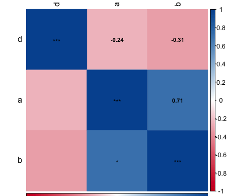

<!-- README.md is generated from README.Rmd. Please edit that file -->

# hcictools

<!-- badges: start -->

<!-- badges: end -->

The goal of hcictools is to …

## Installation

You can install the released version of hcictools from
[CRAN](https://CRAN.R-project.org) with:

``` r
install.packages("hcictools")
```

And the development version from [GitHub](https://github.com/) with:

``` r
# install.packages("devtools")
devtools::install_github("HCIC/r-tools")
```

## Package Contents

This is a package that contains helpful functions for survey data
analysis. It is maintained by the Human-Computer Interaction Center at
RWTH Aachen University.

## Installing the package

You can install this packages by running the following code.

``` r
  install.packages("devtools")
  library(devtools)
  devtools::install_github("statisticsforsocialscience/hcictools")
```

## Plotting Features

### Correlation Plots

``` r
a <- c(1,2,3,8,4,5,6,7)
b <- c(4,5,6,7,3,8,9,10)
d <- c(4,2,5,2,5,2,1,5)
df <- data.frame(a = a, b = b, d = d)

cor.matrix.plot(df)
```



### Confidence Interval Plots

It has a confidence interval plotting feature for indepedent sample
tests.

``` r

plot_IS_meansCI(a, b)
```


## RWTH Palette

Drawing palettes and RWTH Corporate CI Colors

``` r

draw.palette(unlist( rwth.colorpalette() ))
```


## TBC More to follow
